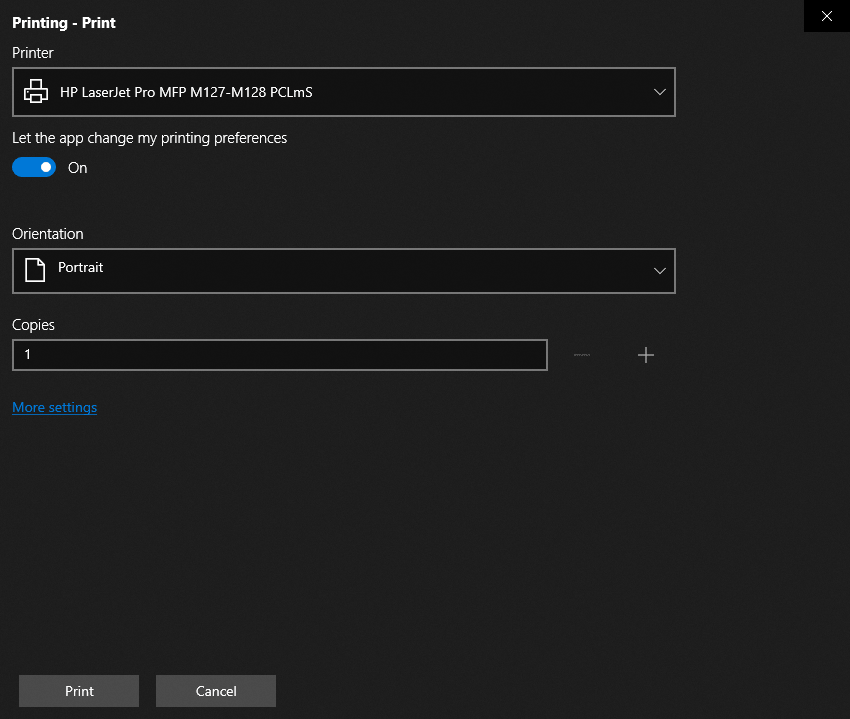

# How to Disable Print Preview in UWP DataGrid?

This sample illustrates how to disable the print preview in [UWP DataGrid](https://www.syncfusion.com/uwp-ui-controls/datagrid) (SfDataGrid).

`DataGrid` provides support to print the data displayed in the `DataGrid` using [SfDataGrid.Print](https://help.syncfusion.com/cr/uwp/Syncfusion.UI.Xaml.Grid.SfDataGrid.html#Syncfusion_UI_Xaml_Grid_SfDataGrid_Print) method.

You can disable the print preview in print dialog by setting `PrintTask.IsPreviewEnabled` property to `false`.

``` csharp
this.dataGrid.PrintTaskRequested += DataGrid_PrintTaskRequested;

private void DataGrid_PrintTaskRequested(object sender, DataGridPrintTaskRequestedEventArgs e)
{
    e.PrintTask = e.Request.CreatePrintTask("Printing", sourceRequested =>
    {       
        sourceRequested.SetSource(e.PrintDocumentSource);
    }); 
	e.PrintTask.IsPreviewEnabled = false;
}
```

